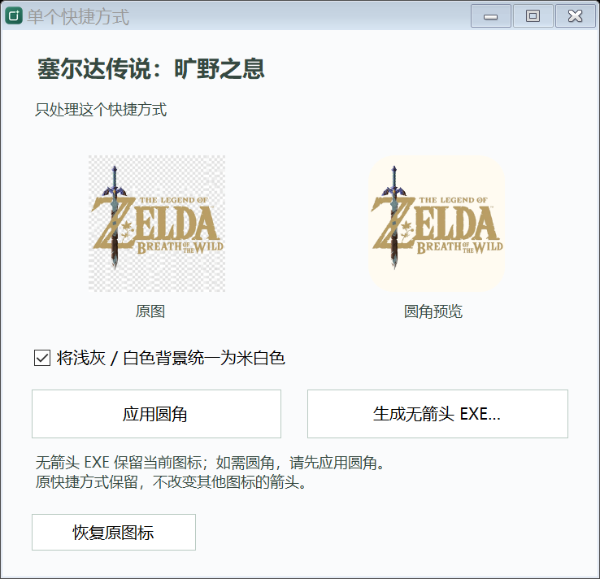

<div align="center">

# 快捷方式箭头 · 便携版 (Shortcut Arrow Portable)

**轻量优雅的 Windows 快捷方式箭头管理工具 · 单文件免安装 · 全局去箭头 · 单个无箭头启动器 · 图标圆角美化**

[](https://github.com/huashuimoyv/shortcut-arrow-portable/releases)
[](https://www.microsoft.com/)
[](https://dotnet.microsoft.com/)
[](源码/ArrowTool.cs)
[]()
[](LICENSE)
[](源码/test-individual.ps1)

[📥 立即下载便携版 (Releases)](https://github.com/huashuimoyv/shortcut-arrow-portable/releases/latest) · [✨ 核心特性](#-核心特性) · [🖼️ 界面预览](#️-界面预览) · [🚀 使用指南](#-使用指南) · [🛡️ 安全设计](#️-安全与容灾设计) · [🛠️ 源码构建](#️-源码构建与测试) · [🌐 English Summary](#-english-summary)

</div>

---

## 💡 为什么需要这个工具？

在 Windows 桌面上，快捷方式左下角的小箭头往往会遮挡图标细节并破坏桌面美感。然而，传统去箭头方法存在不少隐患与局限：

1. **粗暴删除 `IsShortcut` 键值**：导致 Win+X 快捷菜单失灵、任务栏图标右键菜单异常、特定系统程序无法启动等严重的系统级副作用；
2. **缺乏状态备份**：许多批处理脚本直接覆盖系统键值，没有记录操作前的数据，用户想还原时常常束手无策；
3. **无法单独处理**：Windows 系统原生箭头属于系统类型叠加图标，常规设置只能“全机一刀切”，无法满足“只想去掉某一个或几个图标的箭头”的需求。

**快捷方式箭头 · 便携版** 采用**安全无损、原生便携**的设计理念，完美兼顾全机管理与单个图标的精细化定制。

---

## ✨ 核心特性

- 🛡️ **安全无破坏去箭头**：仅通过修改 `HKLM\SOFTWARE\Microsoft\Windows\CurrentVersion\Explorer\Shell Icons` 中的 `29` 号值引入原生透明图标，**绝不修改、不删除 `IsShortcut`**，彻底告别系统副作用。
- 📦 **免安装单文件便携运行**：全功能打包为单个独立 EXE（约 120 KB），无需安装、不写开机自启、不常驻后台进程，使用系统内置 .NET Framework 4.x 即可直接运行。
- 🎯 **单个快捷方式独立启动器（独创特色）**：
  - 支持直接将桌面 `.lnk` 拖入窗口；
  - 一键生成真正的**无箭头独立 EXE 启动器**，保留原本完整的启动路径、命令行参数与工作目录；
  - 启动器不依赖全机箭头设置，不改变原有快捷方式，不想要时直接删除 EXE 即可，干净彻底。
- 🎨 **图标圆角美化与底色统一**：
  - 一键为快捷方式图标应用现代平滑抗锯齿圆角；
  - 支持将刺眼的浅灰或纯白背景智能统一为温润米白，提升桌面视觉质感；
  - 支持一键无损还原原始图标。
- 🔒 **严格的容灾备份与防冲突保护**：首次修改前完整备份原键值与其注册表类型；如检测到其他第三方美化工具修改过，程序会主动拦截并拒绝随意覆盖。

---

## 🖼️ 界面预览

### 1. 全局箭头管理主窗口
支持一键去除箭头、恢复原样、重启桌面以刷新图标缓存：

<div align="center">
  
</div>

### 2. 单个快捷方式处理窗口
拖入任意快捷方式后，可选择应用圆角、底色调和、生成独立无箭头启动器或还原图标：

<div align="center">
  
</div>

### 3. 精心设计的原生图标
内置专属设计的「清隅」图标，沉静森林绿搭配利落切面与四角光芒，兼顾高 DPI 与桌面深浅壁纸适配：

<div align="center">
  
</div>

---

## 🚀 使用指南

### 方案 A：全局去除 / 恢复快捷方式箭头
1. 双击运行 `快捷方式箭头.exe`；
2. 点击 **「去除箭头」**（需允许 UAC 管理员权限请求）；
3. 若桌面未立即生效，点击 **「重启桌面」**（资源管理器会短暂重启以刷新缓存，请先完成正在进行的复制/移动文件操作）；
4. 需要恢复时，随时点击 **「恢复原样」** 即可。

### 方案 B：单独处理单个快捷方式
1. 将桌面上的任意快捷方式（`.lnk`）拖放到 `快捷方式箭头.exe` 文件上，或拖入已打开的主窗口，亦可点击底部 **「单个图标」** 手动选择文件；
2. 在弹出的处理窗口中选择相应操作：
   - **应用圆角**：仅修改该快捷方式图标为圆角效果，保留原本启动目标与参数；
   - **将浅灰 / 白色背景统一为米白色**：勾选后智能柔化浅色底色；
   - **生成无箭头 EXE**：在所选位置生成一个无箭头的独立轻量 EXE 启动器，无需修改系统全局箭头即可享受纯净视觉；
   - **恢复原图标**：一键还原本工具首次处理前的原始图标。

---

## 🛡️ 安全与容灾设计

| 维度 | 设计规范 |
| :--- | :--- |
| **注册表操作** | 严格限定在 `Shell Icons\29`，绝不触碰 `IsShortcut` 键 |
| **数据备份** | 首次修改前将原配置以 XML 序列化保存在 `%ProgramData%\ShortcutArrowPortable\previous.xml` |
| **防外部冲突** | 若当前键值与备份记录不匹配（被其他软件修改过），提示并终止操作，防止误改用户个性化配置 |
| **独立启动器** | 内部快捷方式数据保存在 `%LocalAppData%\ShortcutArrowPortable\Launchers`，启动器本体与桌面原快捷方式完全解耦 |
| **单图标备份** | 单个图标元数据保存在 `%LocalAppData%\ShortcutArrowPortable\Icons`，支持无缝逆向回滚 |
| **权限原则** | 日常浏览与单个图标处理无需管理员权限；仅在修改 HKLM 全局箭头时按需请求提权 |

---

## 🛠️ 源码构建与测试

本项目无需安装庞大的 Visual Studio，使用 Windows 系统自带的 C# 编译器 (`csc.exe`) 即可秒级完成编译与测试。

### 1. 一键编译
在项目根目录下通过 PowerShell 运行：

```powershell
powershell -ExecutionPolicy Bypass -File .\build.ps1
```

编译完成后将在根目录生成经过优化的 `快捷方式箭头.exe`（内置应用清单与高 DPI 矢量支持）。

### 2. 自动化测试
运行单元测试套件：

```powershell
powershell -ExecutionPolicy Bypass -File .\源码\test-individual.ps1
```

测试套件包含 12 项严格的断言验证，包括：
- 最大图标帧解析与抗锯齿处理
- 圆角边缘透明度与中心图案完整性
- 目标路径、Unicode 命令行参数与工作目录透传
- 独立 EXE 启动器在原始快捷方式删除后的无依赖独立唤起验证
- 外部图标篡改保护与重复圆角回滚逻辑

---

## 📂 项目结构

```text
shortcut-arrow-portable/
├── 快捷方式箭头.exe      # 预编译好的便携版单文件可执行程序
├── 使用说明.txt          # 纯文本离线使用说明
├── build.ps1             # 根目录快速构建脚本
├── LICENSE               # MIT 开源协议
├── README.md             # 项目中文与英文说明文档
└── 源码/                 # 核心源码与测试资源
    ├── ArrowTool.cs       # 全局箭头管理、注册表交互与主窗体实现
    ├── IndividualIcons.cs # 单个快捷方式解析、无箭头启动器生成与图像圆角处理
    ├── app.manifest       # Windows Vista/7/8/10/11 兼容性与高 DPI 清单
    ├── app-icon.ico       # 多分辨率应用图标 (16x16 ~ 256x256)
    ├── build.ps1          # 编译器调用脚本
    ├── make_icon.py       # 图标自动化生成与预览脚本 (Pillow)
    ├── test-individual.ps1# 自动化回归测试套件
    └── 图标设计.md        # UI/UX 图标设计理念说明
```

---

## 🌐 English Summary

**Shortcut Arrow Portable** is a lightweight, zero-dependency Windows desktop tool designed to cleanly manage shortcut overlay arrows and customize application icons.

### Key Features
- **Safe Global Arrow Removal**: Modifies only `HKLM\SOFTWARE\Microsoft\Windows\CurrentVersion\Explorer\Shell Icons` (Value `29`) using a transparent icon overlay. It **never deletes `IsShortcut`**, avoiding common Windows Explorer and Win+X menu breakage.
- **Standalone No-Arrow EXE Launcher Generator**: Allows users to convert a specific `.lnk` shortcut into a lightweight, arrow-free standalone executable launcher without altering global system settings.
- **Icon Rounding & Background Harmonization**: Drag-and-drop any shortcut to apply smooth antialiased rounded corners and optionally harmonize harsh white/light-gray backgrounds to soft off-white.
- **Portable & Self-Contained**: Compact single-file executable (~120 KB) targeting .NET Framework 4.0+, which is pre-installed on modern Windows 10/11 systems. No installer, no background services, no startup registry items.
- **Rollback & Conflict Protection**: Backs up original registry entries before making changes and refuses to overwrite if modified by third-party utilities. Full one-click restoration supported.

---

## 📜 许可证 (License)

本项目采用 [MIT License](LICENSE) 开源协议，欢迎自由使用、分发与贡献代码。
